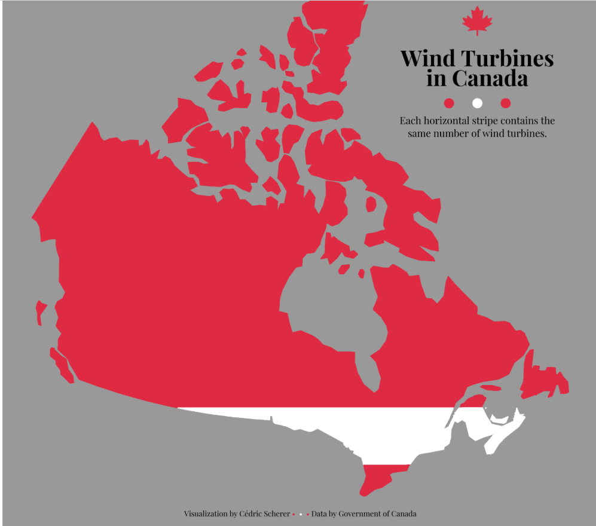
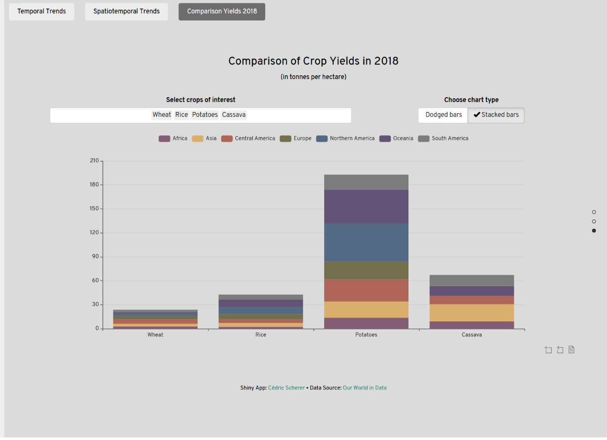
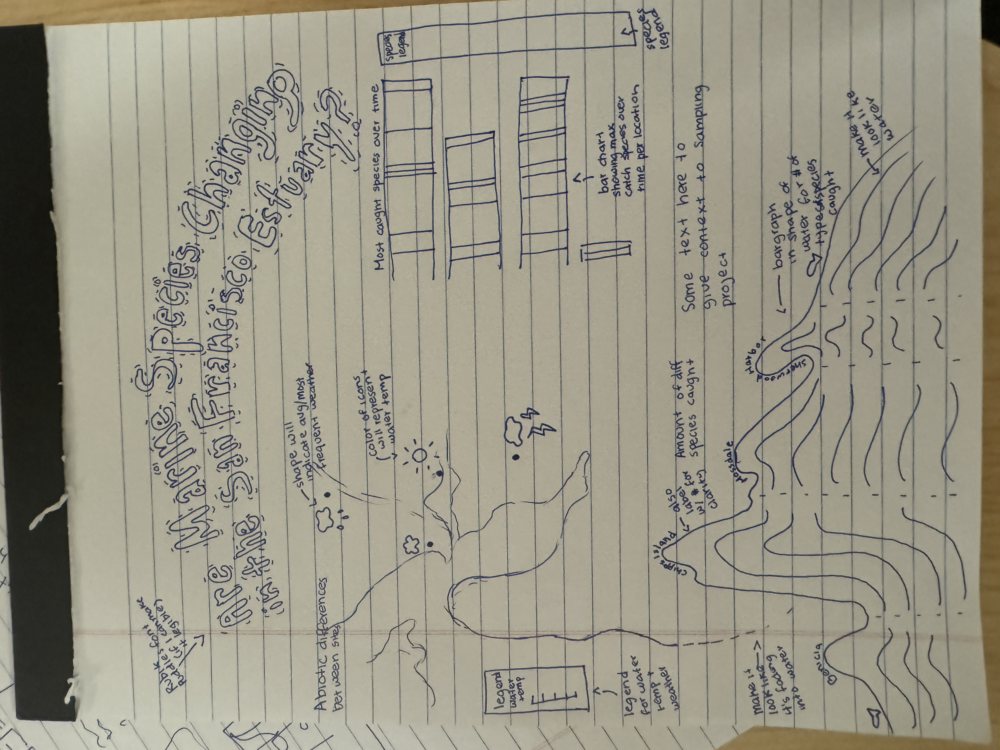
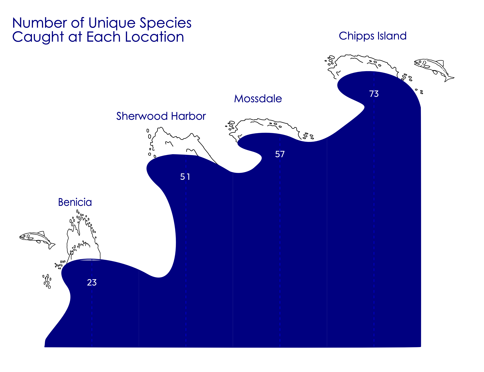
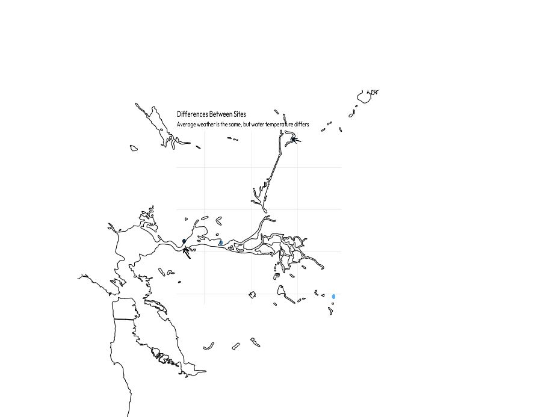
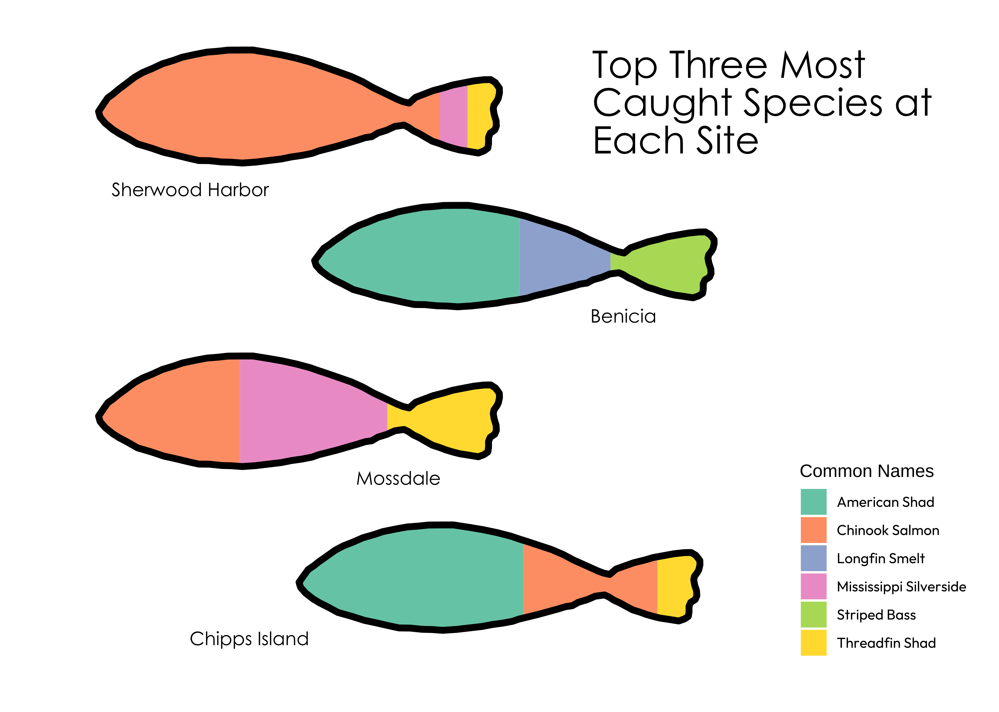

```{r}
#| quiet: true
#| output: false

# load libraries
library(tidyverse)
library(here)
library(janitor)
library(ggtext)
```

```{r}
#| quiet: true
#| output: false


# load fonts

library(showtext)

# can't find some of the fonts so will add in affinity

#font_add_google(name = "Rubik Puddles", family = "puddles")
#font_add_google(name = "Rubik Glitch", family = "glitch")
font_add_google(name = "Flavors", family = "flavors")
#font_add_google(name = "DynaPuff", family = "dynapuff")
#font_add_google(name = "Rubik Vinyl", family = "vinyl")
font_add_google(name = "Outfit", family = "outfit")


font_add('fa-reg', 'fonts/Font Awesome 6 Free-Regular-400.otf')
font_add('fa-brands', 'fonts/Font Awesome 6 Brands-Regular-400.otf')
font_add('fa-solid', 'fonts/Font Awesome 6 Free-Solid-900.otf')


showtext_auto()


```


```{r}
#| quiet: true
#| output: false


# load data
fish_02_24 <- read_csv(here("data", "2002-2024_DJFMP_trawl_fish_and_water_quality_data.csv"))
locals <- read_csv(here("data", "DJFMP_Site_Locations.csv"))
```


```{r}
#| quiet: true
#| output: false

# load previously cleaned data from HW 2
fish_clean <- fish_02_24 |> 
  clean_names() |> 
  select_if(~ sum(is.na(.)) < 750000)
```


**1. I plan to pursue option 1**

**2. My questions have changed. They are now:**

Overarching questions: 
How do fish and other marine species catches differ between sites in the San Francisco Estuary?

Sub-questions: 

- What are the top three most caught marine organisms at each site?

- How many unique marine organisms were sampled at each site?

- What are the abiotic differences between each site? (water temp, weather, location, etc)


**3. Variables needed for each question**

question 1: What are the top three most caught organism at each site?

From the raw data from `fish_02_24` I created a cleaned data set that changed all column names to lower snake case and got rid of any columns with over 750,000 NAs (too many NAs to be a helpful metric to use). From the cleaned dataset, `fish_clean`, I will also use the variable `common_name` (or `iep_fish_code` if I want shorter labels) and find the number of samples (rows) of each species type. Lastly, I will use the `location` column to group the catches by site. 

question 2: What is the amount of unique catch types of organisms by site?

This question will use the variables `location` and `common_name` (or `iep_fish_code`). Instead of looking at the "mode" (the most observed organism at each site), we will instead focus on organism type, where the amount of observations doesn't matter. We will simply be looking at the unique names of organisms observed at each site. Using `common_name`, I will create a column of unique common names, grouped by `location`.

question 3: What are the abiotic differences between each site? 

For this question we will use the `location`, `water_temp`, and `weather_code` from the `fish_clean` dataset. I will find the average `water_temp` and `weather_code` per site. I will also use the `locals` dataset to look at `longitude` and `latitude` in order to compare site locations. I plan to use the lat and long to create a very simple map showing site locations relative to each other. 


**4. Data visualization inspiration** 



Potential idea for displaying abiotic features I like the idea of using a map of the site or of the bay area in general to show average water temperature, weather, and to also represent location. Would need to play around with how to implement this idea, but could be fun. Another idea is to do something similar with the overlay of the map, maybe with a different question




Possible inspo for max organism caught by site. I think a stacked barplot could be cool. I think each site could be on the x axis and amount could be on the y. I liked this chart specifically because it showed the information in a both aesthetic and helpful way.

**5. Sketch of infographic**




*I originally had a slightly different first question that involved dates and was going to create a stacked bar chart. Unfortunately I couldn't figure that graph out (after many hours of attempts), so I switched the question a bit and changed my design. So this sketch isn't exactly what I ended up making*

Answering: What is the amount of unique catch types of organisms by site?

*my plan is to make this look like waves in affinity*

```{r}
#| eval: true
#| warning: false
#| message: false

# find unique common names by location
fish_unique <- fish_clean |> 
  select(location, common_name, sample_date) |> 
  group_by(location) |> 
  summarize(nunique = n_distinct(common_name)) 

# plot amount of unique species per location
unique_plot <- ggplot(data = fish_unique, aes(x = location, y = nunique)) +
  geom_col(color = "blue3", fill = "navy", width = 1) +
  geom_text(aes(label = nunique, 
                vjust = 4), 
            color = "white", 
            size = 5,
            family = "outfit") +
  theme_bw() +
  scale_x_discrete(expand = c(0, NA)) +
  scale_y_continuous(expand = c(0, NA), limits = c(0, 80)) +
  labs(
    title = "Number of Unique Species Caught at Each Location"
  ) +
  theme(
    axis.title.x = element_blank(),
    axis.title.y = element_blank(),
    # I anticipate changing the style of the title in affinity so I'll leave it for now
    title = element_text(family = "outfit"),
    axis.text = element_text(family = "outfit",
                             size = 12),
    panel.grid.major = element_blank(),
    panel.grid.minor = element_blank(),
    panel.border = element_blank(),
    panel.background = element_blank(),
    axis.ticks = element_blank(),
    axis.text.y = element_blank())

print(unique_plot)
```

I worked in affinity to make this look like waves, this is what I have so far


Answering: What are the abiotic differences between each site? 

wrangling
```{r}
#| eval: true
#| warning: false
#| message: false

# filter for only the sites in the fish_clean dataset, and select only long and lat
locals_sites <- locals |> 
  filter(Location == c("Chipps Island", "Benicia", "Mossdale", "Sherwood Harbor")) |> 
  select(Location, Latitude, Longitude) |> 
  clean_names()

# select only needed columns for question
fish_abiotic <- fish_clean |> 
  select(location, weather_code, water_temp) |> 
  na.omit(water_temp, weather_code) 
  
# find average water temp by location
fish_water <- fish_abiotic |> 
  group_by(location) |> 
  summarize(avg_water_temp = mean(water_temp)) 

# find average (mode) weather by location
fish_weather <- fish_abiotic |> 
  group_by(location) |> 
  summarize(weather = DescTools::Mode(weather_code))

# join all datasets together
fish_join <- fish_weather |> 
  full_join(fish_water, join_by(location)) 

local_join <- fish_join |> 
  full_join(locals_sites, join_by(location)) 

```

visualize

*I will overlay a map on this to show the location of each site*

*I want to make the shape of the dots into the sun, tbd on doing that*
```{r}
#| eval: true
#| warning: false
#| message: false


# plot scatter plot with color as water temperature
temp_plot <- ggplot(data = local_join, aes(y = latitude, x = longitude, color = avg_water_temp, label = "<span style='font-family:fa-solid;'>&#xf2c8;</span>")) +
 # geom_point(size = 10) +
  geom_richtext(size = 60, label.colour = NA, fill = NA) +
  scale_color_gradient(low = "navy",
                       high = "red") +
  #geom_text(aes(label = location)) +
labs(
  title = "Temperatures Differ Across Sampling Sites",
  subtitle = "Average temperature changes up to ten degress between sites",
  color = "Avg. Water Temp (°C)"
) +
  theme_bw() +
  theme(
    axis.title = element_blank(),
    axis.text = element_blank(),
    axis.ticks = element_blank(),
    panel.grid.minor = element_blank(),
    panel.border = element_blank(),
    panel.background = element_blank(),
    title = element_text(family = "outfit",
                         size = 15),
    legend.text = element_text(family = "outfit"),
    legend.position = "left"
  ) 

print(temp_plot)
```

What I have so far for this in affinity is very rough, but here is the general idea



Answering: 

What are the top three most caught marine organisms at each site?

wrangling
```{r}
#| warning: false
#| message: false
#| quiet: true


# Calculate the catch count for each common_name
fish_max <- fish_clean |> 
  group_by(location, common_name) |> 
  summarize(max_catch = n(), .groups = "drop") 


# Find the top three highest catches for each location
fish_top <- fish_max |> 
  filter(common_name != "No catch") |> 
  arrange(desc(max_catch)) |> 
  group_by(location) |> 
  slice(1:3) 
```

visualize

*my idea is to have each location look like a fish? But I'll do a similar thing with the waves and mask a bar chart to a fish shape in affinity*

```{r}
#| eval: true
#| warning: false
#| message: false

# plot top three catch types by site
fish_top_three <- ggplot(data = fish_top, aes(fill = common_name, x = location, y = max_catch)) +
  geom_bar(position = "fill", stat = "identity", width = .7) +
  scale_fill_brewer(palette = "Set2") +
  labs(fill = "Common Names") +
  # this isn't working with a filled bar chart, I'll just add labels in affinity
 # geom_text(aes(label = max_catch)) +
  theme(
    axis.title = element_blank(),
    axis.text.x = element_blank(),
    axis.ticks = element_blank(),
    panel.grid.major = element_blank(),
    panel.grid.minor = element_blank(),
    panel.border = element_blank(),
    panel.background = element_blank(),
    legend.text = element_text(family = "outfit"),
    axis.text = element_text(family = "outfit")
  ) +
  coord_flip()

print(fish_top_three)

ggsave(
  filename = here::here("images", "top_catch.pdf"),
  plot = fish_top_three,
  device = "pdf",
  width = 14, 
  height = 12,
  unit = "in",
  dpi = 300,
  scale = 0.6
)

```


*I will add the labels later in affinity, I need to figure out how to import the font I want*

**7. Answer the following questions:**


a. What challenges did you encounter or anticipate encountering as you continue to build / iterate on your visualizations in R? If you struggled with mocking up any of your three visualizations (from #6, above), describe those challenges here.

I originally struggled A LOT with the axis for date in my first question. I couldn't figure out how to make the scale what I wanted it to be and make it legible. Without figuring out that step, I couldn't continue working on the finer details of my plot and making it make sense. I want to eventually add annotations to my plot, but it's difficult if I can't even see the axes. After MANY hours of work I decided it wasn't worth it, and decided to do a different type of graph that did not involve dates. 

I also struggled with font awesome. I wanted to change the shape of my scatter plot dots to a sun to represent the average weather at each location. I tried a bunch of methods, but couldn't quite figure out how to add them in R. I'll figure it out for the final HW 4. 


b. What ggplot extension tools / packages do you need to use to build your visualizations? Are there any that we haven’t covered in class that you’ll be learning how to use for your visualizations?

I'm using `showtext()` for my fonts, and would like to eventually use `ggforce` for cool annotations, although I haven't yet. I also used `scales` in my plots. To do the wrangling I used `DescTools` to find the mode weather at each site, which is something I don't believe we've talked about in class.


c. What feedback do you need from the instructional team and / or your peers to ensure that your intended message is clear?


I want to make sure that the overarching question of "How do fish and other marine species catches differ between sites in the San Francisco Estuary?" is clear. I might have to change the question to something about changes throughout the estuary instead of throughout time. Feedback on the ~vibes~ of the infographic would also be great. I'm going for very playful and water themed. And please feel free to help me with any of the code I'm stuck on! 


