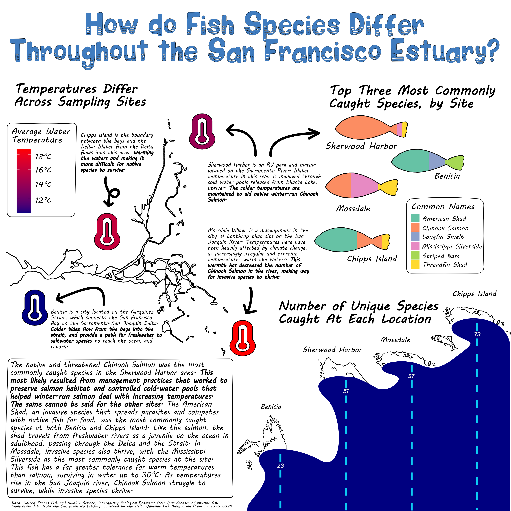

I've been to San Francisco numerous times, seeing the Painted Ladies, going to Alcatraz, even walking across the Golden Gate Bridge, but creating this infographic made me see the city and its surrounding area in a whole new light. I became entranced with the vast ecosystem of the Sacramento and San Joaquin Rivers, the Delta, and the bays; the people that rely on the water across California; and the grand efforts to save the Chinook Salmon through management practices I had never even considered before. The next time I'm in San Francisco, I will not only being looking up at the wonders above ground, but down to try and catch a glance at the fish that are competing for survival in a world of their own. 

My data for this infographic comes from the [Interagency Ecological Program: Over four decades of juvenile fish monitoring data from the San Francisco Estuary, collected by the Delta Juvenile Fish Monitoring Program, 1976-2024](https://portal.edirepository.org/nis/mapbrowse?scope=edi&identifier=244 ), which is the result of a program from the United States Fish and Wildlife Service.  

When I originally picked this dataset, it was a simple choice. The data was easy to access, fairly clean, and I like fish right? But as I spent months wrangling, exploring, struggling, and eventually creating the plots used in my visualizations, I grew to have a deep love and an even deeper understanding of past mistakes that have led to invasive species taking root in the estuary, and the fight to protect native species like Chinook Salmon. 

My visualizations answer the questions: How do fish species catches differ between sites in the San Francisco Estuary?

With three subquestions: 

- What are the top three most commonly caught fish species at each site?

- How many unique marine organisms were sampled at each site?

- What is the average water temperature differences between each site?


Here is how my infographic turned out!

{fig-alt="An infographic with the title: How do Fish Species Differ Throughout the San Francisco Estuary. The infographic contains three separate plots. The first plot is titled, the three most commonly caught species at each site. The plot is a bar chart made into the shape of fish, where each bar is a different location (Benicia, Chipps Island, Sherwood Harbor, and Mossdale). The second plot is a bar chart titled, Number of Unique Species Caught at Each Location. These bars are made into the shape of waves, and each bar is from each location (Benicia, Chipps Island, Sherwood Harbor, and Mossdale). The third plot is a scatter plot titled, Temperatures Differ Across Sampling Sites. Each point is in the shape of a thermometer and is colored by temperature. The infographic describes efforts to help the Chinook Salmon, and how invasive species have become common in the area."}

I always love making data visualizations as fun as possible. Data can often feel very serious and dry, and I like to challenge myself to change that narrative, hence my colorful and playful themes I went with in this graphic.

Here are some elements that I thought about in my infographic:

1. graphic form 

In order to maximize the simplicity and ease of interpretation , I chose only very basic and common plot types for my infographic. Bar charts and scatter plots are not only easy for me to read, but also easier for me to edit in Affinity Designer. 

2. text

I chose to remove the axis labels from my plots because I felt that the simplicity of the plots made them legible even without them. I added titles to every plot in Affinity Designer to make it easier to place them in the exact locations I wanted. I also added annotations to infographic, which became an extremely important part of the visualizations. Without the annotations, the plots are cool but aren't telling much of a story. With them, I can connect the plots together and talk about Chinook Salmon and invasive species, which adds another layer to the entire infographic. 

3. themes 

In {ggplot2}, I modified  the themes of all of the plots. I changed the width of my bar charts, the colors, the sizes of my points, and the shape of my points. I then transferred all of my work to Affinity Designer, where I added some major design elements that changed the shape of the bar charts completely.

4. colors

I wanted my infographic to have playful and fun vibes, while still having colors that made sense. All of my palettes are colorblind friendly, and make sense for what they're visualizing. The wave chart is blue, and the thermometers have a blue to red palette. I let myself be more creative with the colors of the fish, creating a palette that aesthetically worked with the rest of the visualizations and text. 

5. typography

I had so much fun finding cool water and fish themed fonts online. I tested out a bunch of them, and decided that the font *Wavepool* and *MV Boli* matched my playful theme I was going for the most. I wanted it to look handwritten, while also staying very legible. 


6. general design

Because my plots were pretty minimal, I went a little crazier with the annotations. I used font thickness, size, color, and boxes around text to draw the eye to different elements. Without the annotations, the story of the infographic is very different and less meaningful. 

7. contextualizing the data

In a box in bigger font I connected all the plots together by mentioning fish species type and their environments. In the annotations I gave context about individual sites such as body of water they were on and explained the temperature differences. By doing this, I fit in a lot of information about the estuary and still managed to keep it aesthetically pleasing. 

8. centering the primary message

The primary message was to think about the ecosystem and environment of the estuary. I wanted to show the problems in the estuary such as invasive species, and also the efforts and struggles in saving the Chinook Salmon in the area. I put this information in boxes and annotations around the graphic. 

9. considering accessibility 

I considered accessibility be making the palette colorblind friendly and adding alt text in the code to make it accessible to visually impaired users. 

10. applying a DEI lens

My plot doesn't directly talk about people, but I did try to stress the importance of preserving the native species in the area. I also wanted to make sure that I was considering cultural implications that could be associated with colors, font family, and designs. 

Additional sources that provided valuable information:

[San Francisco Estuary Partnership, *About the Estuary*](https://www.sfestuary.org/our-estuary/about-the-estuary/)

[California Department of Fish and Wildlife, *California Finfish and Shellfish Identification Book*](https://nrm.dfg.ca.gov/FileHandler.ashx?DocumentID=39208)

[Smithsonian Marine Invasions Lab, *Menidia audens*](https://invasions.si.edu/nemesis/species_summary/165993)

[Smithsonian Marine Invasions Lab, *Alosa sapidissima*](https://invasions.si.edu/nemesis/species_summary/161702)

[City of Lathrop CA, *Mossdale Village*](https://www.ci.lathrop.ca.us/planning/page/mossdale-village)

[Williams, J. G., *Juvenile Chinook Salmon (Oncorhynchus tshawytscha) in and Around the San Francisco Estuary*](https://escholarship.org/uc/item/96f2t9xw)

[Christine Parisek, UC Davis Center for Watershed Sciences, *Amazing Invader: American Shad*](https://californiawaterblog.com/2024/06/30/amazing-invader-american-shad/)

[CA Department of Fish and Wildlife, *Winter-run Chinook Salmon*](https://wildlife.ca.gov/Conservation/Fishes/Chinook-Salmon/Winter-run)

If you're interested in the code behind this infographic, take a look below!

```{r}
#| output: false
#| warning: false
#| message: false
#| collapse: true
#| code-fold: true
#| echo: true


# load libraries
library(tidyverse)
library(here)
library(janitor)
library(ggtext)
library(showtext)

# add font awesome fonts
font_add('fa-reg', 'fonts/Font Awesome 6 Free-Regular-400.otf')
font_add('fa-brands', 'fonts/Font Awesome 6 Brands-Regular-400.otf')
font_add('fa-solid', 'fonts/Font Awesome 6 Free-Solid-900.otf')

font_add_google(name = "Flavors", family = "flavors")
font_add_google(name = "Outfit", family = "outfit")

showtext_auto()

# load data
fish_02_24 <- read_csv(here("data", "2002-2024_DJFMP_trawl_fish_and_water_quality_data.csv"))
locals <- read_csv(here("data", "DJFMP_Site_Locations.csv"))

# clean data
fish_clean <- fish_02_24 |> 
  clean_names() |> 
  select_if(~ sum(is.na(.)) < 750000)

# find unique common names by location
fish_unique <- fish_clean |> 
  select(location, common_name, sample_date) |> 
  group_by(location) |> 
  summarize(nunique = n_distinct(common_name)) 

# plot amount of unique species per location
unique_plot <- ggplot(data = fish_unique, aes(x = location, y = nunique)) +
  geom_col(color = "blue3", fill = "navy", width = 1) +
  geom_text(aes(label = nunique, 
                vjust = 4), 
            color = "white", 
            size = 5,
            family = "outfit") +
  theme_bw() +
  scale_x_discrete(expand = c(0, NA)) +
  scale_y_continuous(expand = c(0, NA), limits = c(0, 80)) +
  labs(
    title = "Number of Unique Species Caught at Each Location"
  ) +
  theme(
    axis.title.x = element_blank(),
    axis.title.y = element_blank(),
    # I anticipate changing the style of the title in affinity so I'll leave it for now
    title = element_text(family = "outfit"),
    axis.text = element_text(family = "outfit",
                             size = 12),
    panel.grid.major = element_blank(),
    panel.grid.minor = element_blank(),
    panel.border = element_blank(),
    panel.background = element_blank(),
    axis.ticks = element_blank(),
    axis.text.y = element_blank())

# filter for only the sites in the fish_clean dataset, and select only long and lat
locals_sites <- locals |> 
  filter(Location == c("Chipps Island", "Benicia", "Mossdale", "Sherwood Harbor")) |> 
  select(Location, Latitude, Longitude) |> 
  clean_names()

# select only needed columns for question
fish_abiotic <- fish_clean |> 
  select(location, weather_code, water_temp) |> 
  na.omit(water_temp, weather_code) 
  
# find average water temp by location
fish_water <- fish_abiotic |> 
  group_by(location) |> 
  summarize(avg_water_temp = mean(water_temp)) 

# find average (mode) weather by location
fish_weather <- fish_abiotic |> 
  group_by(location) |> 
  summarize(weather = DescTools::Mode(weather_code))

# join all datasets together
fish_join <- fish_weather |> 
  full_join(fish_water, join_by(location)) 

local_join <- fish_join |> 
  full_join(locals_sites, join_by(location)) 

# plot scatter plot with color as water temperature
temp_plot <- ggplot(data = local_join, aes(y = latitude, x = longitude, color = avg_water_temp, label = "<span style='font-family:fa-solid;'>&#xf2c8;</span>")) +
 # geom_point(size = 10) +
  geom_richtext(size = 60, label.colour = NA, fill = NA) +
  scale_color_gradient(low = "navy",
                       high = "red") +
labs(
  title = "Temperatures Differ Across Sampling Sites",
  subtitle = "Average temperature changes up to ten degress between sites",
  color = "Avg. Water Temp (°C)"
) +
  theme_bw() +
  theme(
    axis.title = element_blank(),
    axis.text = element_blank(),
    axis.ticks = element_blank(),
    panel.grid.minor = element_blank(),
    panel.border = element_blank(),
    panel.background = element_blank(),
    title = element_text(family = "outfit",
                         size = 15),
    legend.text = element_text(family = "outfit"),
    legend.position = "left"
  ) 

# Calculate the catch count for each common_name
fish_max <- fish_clean |> 
  group_by(location, common_name) |> 
  summarize(max_catch = n(), .groups = "drop") 


# Find the top three highest catches for each location
fish_top <- fish_max |> 
  filter(common_name != "No catch") |> 
  arrange(desc(max_catch)) |> 
  group_by(location) |> 
  slice(1:3) 

# plot top three catch types by site
fish_top_three <- ggplot(data = fish_top, aes(fill = common_name, x = location, y = max_catch)) +
  geom_bar(position = "fill", stat = "identity", width = .7) +
  scale_fill_brewer(palette = "Set2") +
  labs(fill = "Common Names") +
  # this isn't working with a filled bar chart, I'll just add labels in affinity
 # geom_text(aes(label = max_catch)) +
  theme(
    axis.title = element_blank(),
    axis.text.x = element_blank(),
    axis.ticks = element_blank(),
    panel.grid.major = element_blank(),
    panel.grid.minor = element_blank(),
    panel.border = element_blank(),
    panel.background = element_blank(),
    legend.text = element_text(family = "outfit"),
    axis.text = element_text(family = "outfit")
  ) +
  coord_flip()

showtext_auto(FALSE)

```

